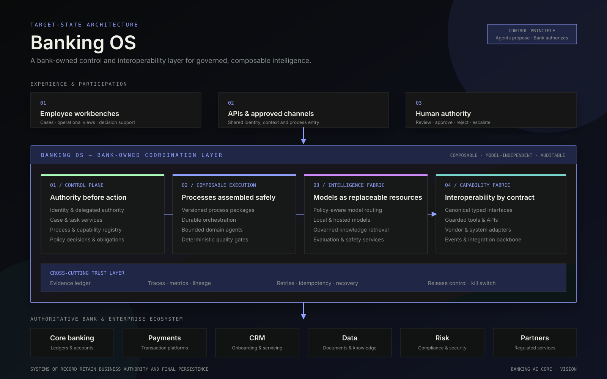

# Banking AI Core — Agentic Harness

> A portfolio-grade reference implementation for governed AI execution across internal banking operations.

[Private portfolio project](https://github.com/MariamJangveladze/banking-agentic-harness) · LangGraph · LangChain · Human approval · Evals · Evidence



## What this is

Banking AI Core is an internal **agent harness**, not a customer chatbot and not a replacement for core banking. It coordinates cases, deterministic workflows, bounded agents, knowledge, policy decisions, human approvals and evidence across internal operations.

The flagship vertical slice is **Product & Process Change**. A synthetic change request is validated, linked to an authoritative source, analyzed in parallel by bounded domain agents, evaluated, paused for Product Support approval and converted into a simulated controlled action.

## The system at a glance

```text
┌──────────────────────────────────────────────────────────────────────┐
│ EXPERIENCE       Operational workbench · APIs · approved channels   │
├──────────────────────────────────────────────────────────────────────┤
│ CONTROL          Router · case service · policy · human approvals   │
├──────────────────────────────────────────────────────────────────────┤
│ ORCHESTRATION    LangGraph processes · bounded loops · checkpoints   │
├──────────────────────────────────────────────────────────────────────┤
│ INTELLIGENCE     LangChain · Ollama · Chroma · policy-aware routing  │
├──────────────────────────────────────────────────────────────────────┤
│ INTEGRATION      Guarded tools · MCP-ready seams · bank adapters     │
├──────────────────────────────────────────────────────────────────────┤
│ EVIDENCE         Events · traces · evals · model/cost attribution    │
└──────────────────────────────────────────────────────────────────────┘
```

**Control principle:** probabilistic components interpret, retrieve, prepare and propose. Deterministic services authorize, persist, commit and control.

## Toward a Banking OS

This harness is a first executable slice of a broader **Banking OS** vision: a governed, composable coordination layer that lets a bank evolve processes, intelligence and integrations without replacing its systems of record or surrendering control to one vendor or model.

The Banking OS is not a new core banking system. It sits above existing systems as an interoperability and control layer, assembling reusable process packages, bounded agents, policies, human decisions and guarded capabilities into auditable operational workflows.

- Read the [Banking OS manifesto](docs/banking-os-manifesto.md) for the case, principles and operating model.
- See the [Banking OS architecture](docs/banking-os-architecture.md) for the target-state diagram, component boundaries and evolution path.

## Implemented evidence

| Capability | Status | Evidence |
|---|---|---|
| Portfolio-style control plane | Implemented | Six interactive views, EN/KA, dark/light |
| Product-change process graph | Implemented | Executable LangGraph vertical slice |
| Parallel impact agents | Implemented | Risk, operations and technology fan-out |
| Human approval gate | Implemented | Durable `interrupt()` / `Command(resume=...)` flow |
| In-run quality gates | Implemented | Evidence, domain, citation and source-linkage evals |
| Evidence and model attribution | Implemented | Append-only state events and usage records |
| Local knowledge/model route | Optional | Chroma + Ollama embeddings/chat via environment |
| Production checkpoint seam | Ready | PostgreSQL checkpointer when configured |
| Enterprise bank adapters | Interface only | No real banking system mutations |

## Demo walkthrough

1. Open **Control tower** to see operational and quality signals.
2. Open **Process graph** and inspect each deterministic, agentic, evaluation and human node.
3. Open **Run explorer** to reconstruct a synthetic case and approve or reject the paused run.
4. Open **Eval lab** to review release thresholds.
5. Open **Governance** to inspect policy boundaries and guarded capabilities.
6. Open **System map** to explain the full harness architecture and non-goals.

The hosted web interaction uses synthetic data. The Python backend independently proves the actual LangGraph behavior.

## Run locally

```bash
npm install
npm run dev
```

```bash
cd backend
uv sync --dev
HARNESS_API_TOKEN="replace-with-a-long-random-local-token" uv run fastapi dev src/banking_harness/api.py --host 127.0.0.1
uv run pytest
```

The model path is keyless and deterministic by default. Case endpoints require a local bearer
token via `HARNESS_API_TOKEN`. Optional local mode uses `MODEL_PROVIDER=ollama`,
`KNOWLEDGE_PROVIDER=chroma`, `OLLAMA_CHAT_MODEL=qwen2.5:7b`, and
`OLLAMA_EMBED_MODEL=nomic-embed-text`.

## Repository structure

```text
app/                         React control plane
backend/src/banking_harness/ LangGraph runtime, policy seams and API
backend/tests/               Workflow and eval regression tests
docs/                        Architecture, process spec and evaluation plan
processes/product-change/    Versioned process-package manifest
```

## Explicit non-goals

- No payments, transfers or financial transactions
- No autonomous credit or customer decisions
- No replacement for core banking, DWH or systems of record
- No bypass of Product Support, control functions or Board authority
- No claim that synthetic UI metrics represent a production deployment

## Documentation

- [Banking OS manifesto](docs/banking-os-manifesto.md)
- [Banking OS architecture](docs/banking-os-architecture.md)
- [Architecture](docs/architecture.md)
- [Product/Process Change specification](docs/product-change-spec.md)
- [Evaluation strategy](docs/evaluation-strategy.md)
- [Security and portfolio boundaries](docs/security-boundaries.md)

Portfolio demonstration. No real bank data, proprietary procedures or production credentials are included.

## Usage and copyright

Portfolio review only. No open-source license is granted. See [COPYRIGHT.md](COPYRIGHT.md)
and report security concerns privately as described in [SECURITY.md](SECURITY.md).
