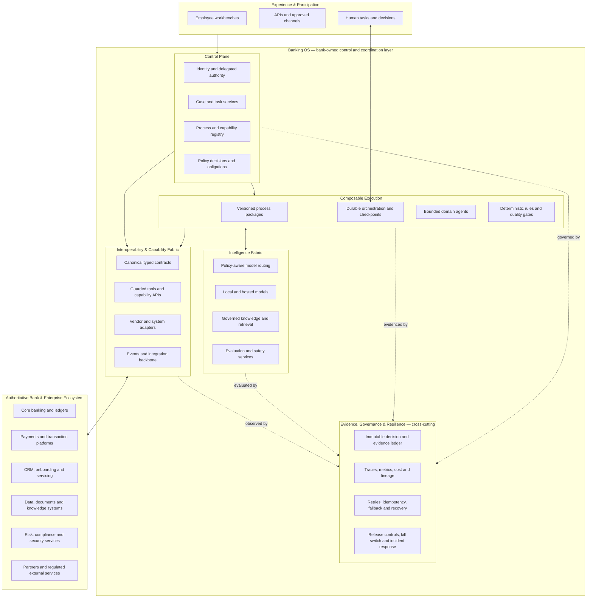
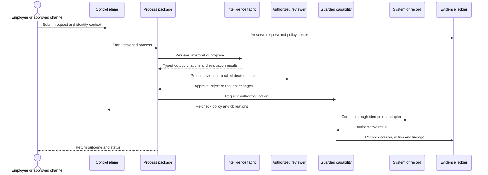

# Banking OS Architecture

## Target-state view

The Banking OS is a bank-owned coordination layer between approved experiences and authoritative enterprise systems. It separates business processes from specific channels, models, agent frameworks and system vendors while keeping policy, human authority and evidence in the execution path.


The rendered overview follows the visual language of the repository's System Map. The Mermaid source below preserves an editable, text-native representation of the same architectural intent.



## Architectural boundaries

| Layer | Responsibility | Key boundary |
|---|---|---|
| Experience and participation | Workbenches, APIs, channels and human decisions | A channel does not grant business authority |
| Control plane | Identity context, cases, registry, policies and obligations | Models do not decide permissions |
| Composable execution | Versioned workflows, durable state, agents and deterministic gates | Agents propose; controlled services authorize transitions |
| Intelligence fabric | Model routing, retrieval, evaluation and safety | Processes depend on contracts, not a specific model |
| Capability fabric | Canonical interfaces, guarded tools, adapters and events | Systems of record remain authoritative |
| Evidence, governance and resilience | Audit lineage, observability, recovery and operational control | Evidence is separate from transient agent memory |

## How a governed request flows



Not every process requires an agent or human approval. The process contract determines which steps apply. Consequential actions always pass through deterministic authorization and guarded capability boundaries.

## Composability and independence

The architecture avoids coupling along four axes:

- **Process independence:** workflows consume canonical capabilities rather than vendor-specific endpoints.
- **Model independence:** a routing policy selects models by classification, quality, residency, cost, latency and availability.
- **Framework independence:** agent runtimes implement typed task and tool contracts; orchestration state does not depend on hidden model memory.
- **Channel independence:** experiences enter through shared identity, case and process services instead of recreating business logic.

Open protocols such as event standards, OAuth/OIDC, OpenAPI and appropriate agent/tool protocols can support these seams. Protocol adoption does not replace bank-owned authorization, schemas, policy enforcement or evidence.

## Agentic execution model

Agents are bounded workers inside a governed process, not owners of the process. Each agent receives:

- a narrow objective and typed input/output contract;
- an approved knowledge scope and explicit source lineage;
- least-privilege tools with read/write distinctions;
- iteration, time, token and cost budgets;
- mandatory evaluation, stop and escalation conditions;
- a traceable model, prompt, tool and configuration version.

The preferred control rule is:

> Probabilistic components interpret, retrieve, prepare and propose. Deterministic services and authorized people control, approve, persist and commit.

## Resilience model

Banking OS resilience is designed at process level, not delegated to an LLM provider:

- durable checkpoints separate recovery state from the authoritative case and evidence ledgers;
- idempotency keys and transactional outbox/inbox patterns prevent duplicate side effects;
- timeouts, bounded retries and circuit breakers isolate failing dependencies;
- model routes support approved fallback, reduced-capability mode and human handoff;
- queues absorb temporary outages and preserve ordered work where required;
- kill switches can disable a model, tool, adapter, process version or automation class;
- replay, simulation and disaster-recovery tests verify that evidence and state remain reconstructable.

## Governance and evolution

Processes, policies, prompts, agent configurations, evaluations, models and adapters are independently versioned. Promotion to a broader scope should require evidence from offline tests, simulation or replay, shadow execution and controlled rollout. Runtime telemetry informs changes, but no production component silently self-modifies its governing policy or release version.

This creates a controlled evolution loop:

```text
Observe → evaluate → propose change → independently review → simulate
        → release gradually → monitor → retain or roll back
```

## How this repository maps to the target state

| Target-state capability | Evidence in this repository | Status |
|---|---|---|
| Operational experience | React control plane and synthetic run explorer | Implemented demo |
| Versioned process package | Product/process change manifest and specification | Implemented vertical slice |
| Durable orchestration | LangGraph graph, interrupt/resume and checkpoint seam | Implemented; production seam documented |
| Bounded agents | Parallel risk, operations and technology analysis | Implemented |
| Evaluation gates | Evidence, domain, citation and linkage checks | Implemented |
| Governed intelligence | Deterministic default; optional Ollama and Chroma | Partial/local |
| Policy-aware enterprise routing | Model gateway seam | Target state |
| Guarded enterprise capabilities | Interface and simulated proposal only | Target state |
| Enterprise identity and authorization | Boundary documented, not integrated | Target state |
| Authoritative case/evidence ledger | Events represented in state; separate ledger required | Target state |

The distinction is deliberate: the repository proves architectural mechanisms without claiming production authority, access to real bank data or the ability to mutate banking systems.
